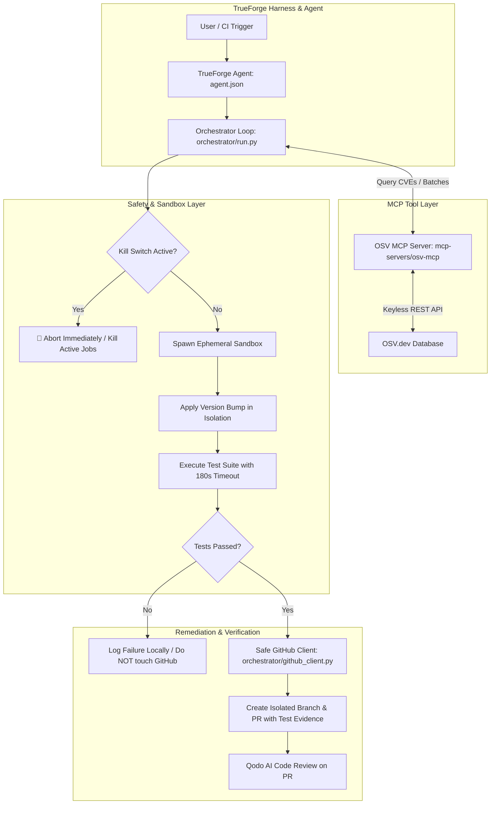

# 🛡️ SentinelPR

> **Autonomous, Safe Dependency Remediation Agent built on [TrueForge](https://github.com/truefoundry/trueforge) & verified with [Qodo](https://www.qodo.ai)**  
> *Built for "The Agent Harness Hackathon" by WeMakeDevs*

---

## 🎯 What SentinelPR Does and Why

Modern software security relies heavily on automated dependency updates, but existing tools frequently cause breakages or lack safety controls. **SentinelPR** is an autonomous security agent that:

1. **Finds Known Vulnerabilities**: Scans project dependency manifests (`requirements.txt`, `package.json`, `pyproject.toml`) and queries **OSV.dev** for CVEs, GHSAs, and minimum fixed versions via a dedicated **Model Context Protocol (MCP)** server.
2. **Executes Safely in an Ephemeral Sandbox**: Clones the repository into an isolated, ephemeral workspace (or Docker container), applies the version bump, and executes the actual test suite with strict wall-clock timeouts.
3. **Proves Compatibility Before Proposing**: Only opens a GitHub Pull Request if 100% of the repository's test suite passes cleanly. If tests fail, it logs the failure locally and never touches GitHub.
4. **Enforces an Instant Kill Switch**: Can be aborted mid-run at any point with `sentinelpr stop`. All active sandbox processes and containers are terminated immediately, guaranteeing **zero side effects** on the source repository.
5. **No Auto-Merge**: Every PR includes full test execution evidence, severity details, and explicit notices requiring human review and approval.

---

| Flow | SentinelPR Implementation |
| :--- | :--- |
| **1. Reaches Real Tools (MCP)** | Exposes a standalone **OSV MCP Server** (`mcp-servers/osv-mcp`) supporting `check_vulnerabilities` and `batch_check` via the official `@modelcontextprotocol/sdk` and streamable HTTP transport for TrueForge. |
| **2. Runs Code Safely (Sandbox)** | Implements `orchestrator/sandbox.py` with ephemeral directory/Docker isolation, hard wall-clock timeouts (default 180s), environment isolation, test runner auto-detection, and guaranteed teardown. |
| **3. Stopped Before Damage (Kill Switch)** | Implements `orchestrator/killswitch.py` and `cli/sentinelpr.py stop`. Checks kill flags before every state transition (scan $\to$ sandbox $\to$ PR) and forcibly kills active child processes and Docker containers instantly. |

---

## 🏗️ Architecture



---

## 📂 Repository Structure

```
Sentinel-TrueForge/
├── agent.json                          # TrueForge Agent Definition (Safety rules + MCP + Model)
├── mcp-servers/
│   └── osv-mcp/                        # Model Context Protocol server for OSV.dev
│       ├── package.json
│       ├── server.mjs                  # Streamable HTTP MCP server
│       ├── test_standalone.mjs         # Standalone MCP test suite
│       └── README.md
├── orchestrator/
│   ├── __init__.py
│   ├── osv_client.py                   # OSV client (MCP connector & REST client)
│   ├── parser.py                       # Manifest parser (requirements.txt, package.json, pyproject.toml)
│   ├── sandbox.py                      # Ephemeral sandbox runner with timeouts & process monitoring
│   ├── killswitch.py                   # Kill switch manager & instant process terminator
│   ├── github_client.py                # Safe GitHub PR creator (branch isolation, no main pushes)
│   ├── template.py                     # PR description template generator with test evidence
│   └── run.py                          # Full orchestrator loop
├── cli/
│   ├── __init__.py
│   └── sentinelpr.py                   # CLI entrypoints (scan, run, stop, status, reset)
├── tests/
│   ├── test_osv_mcp.py                 # OSV MCP & client unit tests
│   ├── test_sandbox.py                 # Sandbox isolation & test verification tests
│   ├── test_killswitch.py              # Kill switch instant abort tests
│   ├── test_orchestrator.py            # Orchestrator dry-run loop tests
│   ├── test_github_client.py           # GitHub client mocked API tests
│   └── demo-repo-fixtures/             # Minimal demo fixtures with real vulnerable packages
│       ├── python-demo/                # jinja2==2.11.2, requests==2.25.1, urllib3==1.26.4
│       └── node-demo/                  # lodash@4.17.15, minimist@1.2.0
├── .github/
│   └── workflows/
│       └── qodo-review.yml             # GitHub Actions CI workflow for Qodo reviews
├── requirements.txt                    # Minimal Python dependencies
├── package.json                        # Project metadata & helper scripts
└── README.md                           # Comprehensive documentation
```

---

## 🚀 Quickstart & Installation

### 1. Prerequisites
- Python 3.10+
- Node.js 20+
- (Optional) Docker (if container isolation is preferred over ephemeral subprocesses)
- (Optional) Ollama with `qwen2.5-coder:latest` (`ollama run qwen2.5-coder`)

### 2. Install Dependencies
```bash
# Clone the repository
git clone https://github.com/Khushi-Agrawal-2019/Sentinel-TrueForge.git
cd Sentinel-TrueForge

# Install Python requirements
pip install -r requirements.txt

# Install OSV MCP Server dependencies
cd mcp-servers/osv-mcp && npm install && cd ../..
```

### 3. Run Automated Tests
```bash
# Run all Python and MCP server tests
npm test
```

---

## 💻 CLI Commands & Usage

### 1. Scan Repository for Vulnerabilities
Scans dependency manifests and displays known CVEs/GHSAs, severity, and minimum fixed versions:
```bash
python3 cli/sentinelpr.py scan --repo tests/demo-repo-fixtures/python-demo
```

### 2. Execute Autonomous Remediation Loop (Dry-Run Mode)
Attempts version upgrades in ephemeral sandboxes and verifies tests pass without touching GitHub:
```bash
python3 cli/sentinelpr.py run --repo tests/demo-repo-fixtures/python-demo --top-n 3 --dry-run
```

### 3. Emergency Kill Switch (`stop`)
Instantly aborts execution, sends `SIGKILL` to active sandbox processes, kills sandbox Docker containers, and guarantees the source repository is untouched:
```bash
python3 cli/sentinelpr.py stop --reason "Judge live demo kill switch"
```

### 4. Check Status and Reset
```bash
# Check current kill switch status and active processes
python3 cli/sentinelpr.py status

# Reset the kill switch for the next execution run
python3 cli/sentinelpr.py reset
```

---

## 🔍 Qodo Review Evidence & PR Directory

SentinelPR's features and autonomous remediation PRs are reviewed and verified by **Qodo** (AI-powered code review platform):

| Pull Request | Type | Qodo Review Status | Link |
| :--- | :--- | :--- | :--- |
| **PR #4: Sandbox Resource Throttling** | `✨ Feature` | ✅ **Reviewed & Resolved** (Qodo flagged unapplied resource limits $\to$ wired up via `resource.setrlimit`) | [#4](https://github.com/Khushi-Agrawal-2019/Sentinel-TrueForge/pull/4) |
| **PR #3: Jinja2 Security Fix** | `🛡️ Remediation` | ✅ **Reviewed & Resolved** (Qodo caught CVE-2025-27516 in 3.1.5 $\to$ upgraded to 3.1.6 & fixed semver selector) | [#3](https://github.com/Khushi-Agrawal-2019/Sentinel-TrueForge/pull/3) |
| **PR #2: urllib3 Security Fix** | `🛡️ Remediation` | 🟢 **Reviewed & Merged** (0 bugs, clean passing sandbox test suite) | [#2](https://github.com/Khushi-Agrawal-2019/Sentinel-TrueForge/pull/2) |
| **PR #1: Qodo Verification Marker** | `🧪 CI/CD` | 🟢 **Reviewed & Merged** (Connection & Agentic Review Triggers Verified) | [#1](https://github.com/Khushi-Agrawal-2019/Sentinel-TrueForge/pull/1) |

### 🛠️ Qodo Review & Remediation Case Studies

#### Case Study 1: Resolving Sandbox Resource Limits (PR #4)
```text
=== Finding by Qodo on PR #4 ===
- Finding: "MAX_MEMORY_LIMIT and MAX_CPU_LIMIT constants defined in config but not enforced in SandboxRunner._execute_test_process."
- Action Taken: Implemented OS-level resource limits via `resource.setrlimit` with `preexec_fn` and Docker cgroup memory/CPU limits.
- Follow-up: Qodo re-reviewed and marked finding as "✓ Resolved (0 bugs)".
```

#### Case Study 2: Catching Incomplete CVE Remediation (PR #3)
```text
=== Finding by Qodo on PR #3 ===
- Finding: "Target remains sandbox-vulnerable (CVE-2025-27516): Jinja2 3.1.5 is still affected by attr filter sandbox breakout; 3.1.6 is the patched version."
- Action Taken: Upgraded Jinja2 pin to 3.1.6 and enhanced SentinelPR's OSV parser with robust semver max resolution.
- Follow-up: Qodo re-evaluated the PR commit and updated review status to "✓ Resolved (0 bugs)".
```

---

## 📜 License & Acknowledgments

- **Agent Harness:** Built on [TrueForge](https://github.com/truefoundry/trueforge) by TrueFoundry.
- **Code Review:** Powered by [Qodo](https://www.qodo.ai).
- **Vulnerability Data:** Powered by [OSV.dev](https://osv.dev).
- **Author:** Khushi Agrawal ([@Khushi-Agrawal-2019](https://github.com/Khushi-Agrawal-2019))
